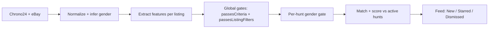

# Hunt → Feed filtering criteria

How a user's **hunts** ([Hunt Builder](hunt-builder-spec.md)) become what they see — and in what order — in the [Vintage Timex Watches Feed](vintage-timex-watches-feed.md). Fetch stage: [marketplace-queries.md](marketplace-queries.md). Goals: [problem-framing.md](problem-framing.md).

This doc owns the mapping between hunt builder, matching, and feed display.

---

## Principle: gates exclude, taste ranks

| | Gates (hard) | Taste (soft) |
|---|---|---|
| Source | Global filters (all hunts) + per-hunt **gender** | Per-hunt attributes |
| Effect | Fails → **never appears** (or excluded from that hunt) | Misses → **ranks lower**, still can match |
| Examples | Price ceiling, ships-to-me; men's hunt vs ladies listing | "Crosshair", "Marlin", "late 60s" |
| Maps to | `passesCriteria()` ([`src/lib/shipping.ts`](../src/lib/shipping.ts)) | `scoreListingAgainstHunt()` ([`src/lib/listings/hunt-match.ts`](../src/lib/listings/hunt-match.ts)) |
| Escape hatch | — | Dealbreaker promotion (not shipped) |

Target behavior: **rank, don't exclude** on taste alone — except gender, which acts as a per-hunt gate.

---

## Pipeline

Gates run **before** matching. Gender runs **inside** `scoreListingAgainstHunt()` before taste scoring.

---

## Gender filtering (shipped)

Each hunt has `gender: "mens" | "womens" | "both"` ([`src/lib/hunts/types.ts`](../src/lib/hunts/types.ts)). Each listing gets `gender` at normalize time via [`inferListingGender()`](../src/lib/listings/gender.ts) from title (and case size heuristics).

At match time, [`listingMatchesHuntGender()`](../src/lib/listings/gender.ts) re-checks the **full title**:

| Hunt gender | Listing handling |
|-------------|------------------|
| **both** | All listings pass gender gate |
| **mens** | Exclude if women's/ladies title signals, or ≤30mm case without men's label; neutral titles pass |
| **womens** | Exclude if men's title signals without women's; symmetric to men's |

A hunt with **only gender set** (no attribute chips) is still active via `huntHasActiveCriteria()` — gender-only hunts populate **Watch-list**.

Summary sentence on Hunts page includes gender when not `both` ([`buildHuntSummary`](../src/lib/hunts/summary.ts)).

---

## Feature extraction

Matching quality depends on [`ExtractedFeatures`](../src/lib/listings/types.ts) populated in normalize. Today:

| Feature | Source | Confidence |
|---|---|---|
| `model` | Title via `matchListingToModel()` | low |
| `era` | Parsed year → bucket | medium |
| `cond` | Inferred from title | low |
| `gender` | Title + size heuristics | medium |
| `collab` | Title via [`inferCollabFromTitle()`](../src/lib/listings/collab.ts) (Peanuts, Disney, Keith Haring, etc.) | medium |

**Collab meta-options at match time:** "Any collab" matches any detected co-brand; "House brand only" matches listings with no collab signal; named partners match title keywords or extracted `features.collab`.

**Degrade gracefully:** unextracted taste attributes render **unverified** on cards, not silent misses.

---

## Matching one listing against one hunt

Effective value set per attribute = `picks ∪ customs`. **Within** an attribute: OR. **Across** attributes: score ratio (hits / specified).

Gender mismatch → `excluded: true`, hunt not added to `matchedHuntIds`.

**Score:** `specified === 0` → base score `0.5` (gender-only hunt). Otherwise `hits / specified`.

Dealbreaker promotion is **not shipped**.

---

## Combining hunts + ranking

- **All** scope (New tab): unseen listings that pass global gates.
- **Watch-list** scope: same pool, filtered to listings with `matchedHuntIds.length > 0` for ≥1 saved hunt.
- Feed rank = **best** hunt score among matched hunts; tie-break by model hearts (legacy) then recency.

[`alertSort`](../src/lib/listings/selectors.ts): best score desc → hearts desc → `listedAt` desc.

---

## Display — "why you're seeing this"

Each **New** card shows ([`alert-listing-card.tsx`](../src/components/alert-listing-card.tsx)):

1. **Why note** from `HuntMatchResult.whyNote`
2. **Matched hunt names** when applicable
3. **Per-attribute hit / miss / unverified** from `attributeMatches`

---

## Global gates mapping

Global filters on `/hunts` sync into `criteria` in the store:

| GlobalFilter | Gate | Where |
|---|---|---|
| `priceCeiling` | Max total cost | `passesCriteria()` |
| `shipsToMe` + `postalCode` | Ships-to-me | `passesCriteria()` |
| always on | Hidden / disliked excluded | `passesListingFilters()` |

Condition is per-hunt taste, not a global gate (except soft exclusion of "For parts" via criteria defaults).

---

## Feed scope (shipped vs future)

| Scope | Shipped in UI | Behavior |
|---|---|---|
| `all` | Yes | All unseen gated listings |
| `watchlist` | Yes | Unseen + ≥1 hunt match |
| `top` | No | Score ≥ 0.7 (code only) |
| `hunt:{id}` | No | Single hunt filter (code only) |

---

## Shipped vs future

| Shipped | Future |
|---|---|
| Hunt match scoring + Watch-list scope | Top picks threshold UI |
| Gender per hunt + title inference | Dealbreaker taste weights |
| Best hunt score sort | Per-hunt scope chips in feed |
| Model + era + cond extraction (partial) | Full dial/case/mvmt from specs |
| Card match reasons | Tap hunt chip to scope feed |

---

## Acceptance criteria (shipped)

- **FC1:** Global gates run before listings appear in New.
- **FC2:** Watch-list shows unseen listings matching ≥1 saved hunt (gender + taste).
- **FC3:** Rank = best hunt score, then recency.
- **FC4:** Gender-only hunts (e.g. Men's only) actively match listings.
- **FC5:** Men's hunt excludes ladies/women's title signals and small-case women's heuristics.
- **FC6:** Custom and preset values normalized identically before compare.
- **FC7:** Cards show match note and attribute status where available.
- **FC8:** `alertScope` resolves to `all` or `watchlist` in UI.

---

## Related files

- [hunt-builder-spec.md](hunt-builder-spec.md), [vintage-timex-watches-feed.md](vintage-timex-watches-feed.md), [marketplace-queries.md](marketplace-queries.md), [problem-framing.md](problem-framing.md)
- [`src/lib/listings/hunt-match.ts`](../src/lib/listings/hunt-match.ts) — `scoreListingAgainstHunt()`, `matchAllHunts()`
- [`src/lib/listings/gender.ts`](../src/lib/listings/gender.ts) — inference + hunt gender gate
- [`src/lib/listings/selectors.ts`](../src/lib/listings/selectors.ts) — `unseenListings`, `alertListings`, `alertSort`
- [`src/lib/shipping.ts`](../src/lib/shipping.ts) — `passesCriteria()`
- [`src/store/caseback.ts`](../src/store/caseback.ts) — `seen`, `listingStatus`, `feedView`, `alertScope`, `hunts`
