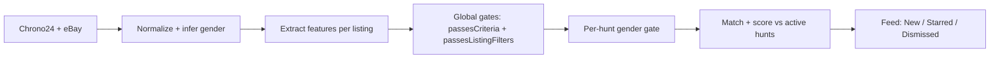

# Hunt → Feed filtering criteria

How a user's **hunts** ([Hunt Builder](hunt-builder-spec.md)) become what they see — and in what
order — in the [Vintage Timex Watches Feed](vintage-timex-watches-feed.md). Fetch stage:
[marketplace-queries.md](marketplace-queries.md). Goals: [problem-framing.md](problem-framing.md).

This doc owns the mapping between hunt builder, matching, and feed display.

---

## Principle: gates exclude, taste ranks

| | Gates (hard) | Taste (soft) |
|---|---|---|
| Source | Global filters (all hunts) + per-hunt **gender** | Per-hunt attributes |
| Effect | Fails → **never appears** (or excluded from that hunt) | Misses → **ranks lower**, still can match |
| Examples | Price ceiling, ships-to-me; men's hunt vs ladies listing | "Crosshair", "Marlin", "late 60s" |
| Maps to | `passesCriteria()` ([`src/lib/shipping.ts`](../src/lib/shipping.ts)) | `scoreListingAgainstHunt()` ([`src/lib/listings/hunt-match.ts`](../src/lib/listings/hunt-match.ts)) |
| Escape hatch | — | Dealbreaker promotion (not shipped) |

Target behavior: **rank, don't exclude** on taste alone — except gender, which acts as a per-hunt gate.

---

## Pipeline



Gates run **before** matching. Gender runs **inside** `scoreListingAgainstHunt()` before taste scoring.

---

## Gender filtering (shipped)

Each hunt has `gender: "mens" | "womens" | "both"` ([`src/lib/hunts/types.ts`](../src/lib/hunts/types.ts)). Each listing gets `gender` at normalize time via [`inferListingGender()`](../src/lib/listings/gender.ts) from title (and case size heuristics).

At match time, [`listingMatchesHuntGender()`](../src/lib/listings/gender.ts) re-checks the **full title**:

| Hunt gender | Listing handling |
|-------------|------------------|
| **both** | All listings pass gender gate |
| **mens** | Exclude if women's/ladies title signals, or ≤30mm case without men's label; neutral titles pass |
| **womens** | Exclude if men's title signals without women's; symmetric to men's |

A hunt with **only gender set** (no attribute chips) is still active via `huntHasActiveCriteria()` — gender-only hunts populate **Hunt Finds** (`watchlist` scope).

Summary sentence on Hunts page includes gender when not `both` ([`buildHuntSummary`](../src/lib/hunts/summary.ts)).

---

## Hunt desire — hearts (1–4)

Each hunt carries `hearts: 1 | 2 | 3 | 4` ([`src/lib/hunts/types.ts`](../src/lib/hunts/types.ts), default `2`) —
how badly the user wants it. Hearts are a **hunt-level** desire weight (`H` in the score below), set in the
hunt builder and shown in `buildHuntSummary`. They are **not** per-attribute importance (that's the future
nice/want/dealbreaker weighting, which refines `C`).

> Model-hearts (the old 1–3 hearts on a model) are **retired** — hunt-hearts are the only desire signal.
> See "Retiring model-hearts" below.

---

## Feature extraction

Matching quality depends on [`ExtractedFeatures`](../src/lib/listings/types.ts) populated in normalize. Today:

| Feature | Source | Confidence |
|---|---|---|
| `model` | Title via `matchListingToModel()` | low |
| `era` | Parsed year → bucket | medium |
| `cond` | Inferred from title | low |
| `gender` | Title + size heuristics | medium |
| `collab` | Title via [`inferCollabFromTitle()`](../src/lib/listings/collab.ts) (Peanuts, Disney, Keith Haring, etc.) | medium |
| `storeFind` | Title via [`inferStoreFindFromTitle()`](../src/lib/listings/store-find.ts) (Deadstock, tags, box) | medium |

**Collab meta-options at match time:** "Any collab" matches any detected co-brand; "House brand only" matches listings with no collab signal; named partners match title keywords or extracted `features.collab`.

**Degrade gracefully:** unextracted taste attributes render **unverified** on cards, not silent misses.

---

## Matching one listing against one hunt

Effective value set per attribute = `picks ∪ customs`. **Within** an attribute: OR. **Across** attributes: a score.

Gender mismatch → `excluded: true`, hunt not added to `matchedHuntIds`.

**Score** — for an eligible hunt (passes gates + gender, no dealbreaker miss):

```
score = C × S × H        // range 0 → 8
```

| Factor | Meaning | Value |
|---|---|---|
| **C** — completeness | hits ÷ specified attributes | `0–1`; gender-only hunt (`specified === 0`) → `C = 1.0` |
| **S** — specificity | hunt tightness band (count of attributes with ≥1 value) | Wide open `0.5` · Loose `1.0` · Focused `1.5` · Very specific `2.0` |
| **H** — desire | hunt hearts | `1–4` |

Misses **and** unverified both count `0` in `C`'s numerator — a low score from unverified means "couldn't
confirm," shown that way on the card, never "wrong." Specificity is multiplicative so a precise hunt that
matches outranks a loose one that matches; desire is multiplicative so a 4-heart hunt scores 4× a 1-heart
hunt at equal completeness and specificity.

Dealbreaker promotion is **not shipped**.

**Worked examples**

| Hunt | C | S | H | Score |
|---|---|---|---|---|
| 3♥ "Marlin · 1970s · blue · crosshair" — full match | 1.0 | 2.0 | 3 | **6.0** |
| 4♥ "any Electric" — full match | 1.0 | 1.0 | 4 | **4.0** |
| 2♥ "Marlin · 1970s" — 1 of 2 hits | 0.5 | 1.5 | 2 | **1.5** |
| 2♥ Men's-only, no chips — gender-only | 1.0 | 0.5 | 2 | **1.0** |

---

## Combining hunts + ranking

```
feedScore(listing) = max( score(listing, hunt) for hunt in matchedHunts )
```

- A listing's feed score is its **best** matching hunt's score. A hunt the listing does **not** match is
  simply absent from the set — it never lowers the score. No cross-hunt penalty, no averaging.
- **All** scope (New tab): unseen listings that pass global gates.
- **Hunt Finds** scope (`watchlist`): same pool, filtered to listings with `matchedHuntIds.length > 0` for ≥1 saved hunt.
- **Per-hunt** scope (`hunt:{id}`): Hunt Finds sub-chips filter to a single saved hunt (shipped in UI).
- Tie-break by recency (`listedAt` desc).

[`alertSort`](../src/lib/listings/selectors.ts): best score desc → `listedAt` desc.

---

## Display — "why you're seeing this"

Each **New** card shows ([`alert-listing-card.tsx`](../src/components/alert-listing-card.tsx)):

1. **Why note** from `HuntMatchResult.whyNote`
2. **Matched hunt name(s)** (replaces the old model-heart badge)
3. **Per-attribute hit / miss / unverified** from `attributeMatches`
4. **Match score** on the 0–8 scale (e.g. `6.0/8`)

---

## Global gates mapping

Global filters on `/hunts` sync into `criteria` in the store:

| GlobalFilter | Gate | Where |
|---|---|---|
| `priceCeiling` | Max total cost | `passesCriteria()` |
| `shipsToMe` + `postalCode` | Ships-to-me | `passesCriteria()` |
| always on | Hidden / disliked excluded | `passesListingFilters()` |

Condition is per-hunt taste, not a global gate (except soft exclusion of "For parts" via criteria defaults).
Disliked-model exclusion is independent of hearts and stays.

---

## Feed scope (shipped vs future)

| Scope | Shipped in UI | Behavior |
|---|---|---|
| `all` | Yes | All unseen gated listings |
| `watchlist` (**Hunt Finds**) | Yes | Unseen + ≥1 hunt match |
| `hunt:{id}` | Yes | Single hunt filter (sub-chips under Hunt Finds) |
| `top` (**Top matches**) | No | `feedScore ≥` strong-match threshold (`≥ 4.0`); exact value TBD |

---

## Retiring model-hearts

Model-hearts (1–3, hearted on a model in Explore/Watch List) are removed. Hunt-hearts are the sole desire
signal; a hearted model becomes a **one-attribute hunt** (`model = X`, default hearts).

| Surface | Was (model-hearts) | Becomes |
|---|---|---|
| `alertSort` tie-break | hearts desc → recency | recency only (desire lives in `H`) |
| **Hunt Finds** scope | models with ≥1 heart | ≥1 hunt match |
| **Top picks (3♥)** chip | models with 3 hearts | **Top matches** — `feedScore ≥` threshold |
| Card heart badge | heart when model on list | matched-hunt chip |
| **Explore** "heart a model" | adds model to Watch List | creates/opens a one-attribute model hunt |
| **Watch List** tab | model-centric heart list | model-only-hunt view, or retire the tab |

**Migration:** seed a one-attribute hunt per hearted model (3♥ → hunt-hearts `4`, 2♥ → `3`, 1♥ → `2`),
then drop the model-hearts field in [`src/store/caseback.ts`](../src/store/caseback.ts).

> Cross-doc edits: `vintage-timex-watches-feed.md` (scope chips, `alertSort`, card badge, Hunt Finds /
> Explore relationship) and `marketplace-queries.md` (Alert-scope row) also reference model-hearts.

---

## Shipped vs future

| Shipped | Future |
|---|---|
| `C × S × H` scoring (hearts + specificity) | Top matches threshold UI |
| Hunt match scoring + Hunt Finds scope | Dealbreaker taste weights |
| Gender per hunt + title inference | Full dial/case/mvmt from specs |
| Per-hunt scope chips under Hunt Finds | Tap hunt chip to scope feed (partial — chips exist) |
| Model + era + cond + collab + storeFind extraction (partial) | Per-attribute nice/want/dealbreaker weights |
| Card match reasons + 0–8 score | Explore tab / model triage |
| model-hearts retirement + migration | — |

---

## Acceptance criteria

- **FC1:** Global gates run before listings appear in New.
- **FC2:** Hunt Finds shows unseen listings matching ≥1 saved hunt (gender + taste).
- **FC3:** Rank = best hunt score, then recency.
- **FC4:** Gender-only hunts (e.g. Men's only) actively match listings.
- **FC5:** Men's hunt excludes ladies/women's title signals and small-case women's heuristics.
- **FC6:** Custom and preset values normalized identically before compare.
- **FC7:** Cards show match note and attribute status where available.
- **FC8:** `alertScope` resolves to `all`, `watchlist` (Hunt Finds), or `hunt:{id}` in UI.
- **FC9:** Per-hunt score = `C × S × H`; a 4-heart hunt scores 4× a 1-heart hunt at equal completeness and specificity.
- **FC10:** At equal completeness and hearts, a "Very specific" hunt outranks a "Loose" hunt.
- **FC11:** Feed score = max over matched hunts; a hunt a listing does not match never lowers its score.

---

## Open decisions

1. `top` / Top-matches threshold on the `0–8` scale (code uses `≥ 4.0`; UI not exposed).
2. Default heart value for a new hunt (`2`).
3. Whether the Watch List tab survives as a model-only-hunt view or retires.

---

## Related files

- [hunt-builder-spec.md](hunt-builder-spec.md), [vintage-timex-watches-feed.md](vintage-timex-watches-feed.md), [marketplace-queries.md](marketplace-queries.md), [problem-framing.md](problem-framing.md)
- [`src/lib/listings/hunt-match.ts`](../src/lib/listings/hunt-match.ts) — `scoreListingAgainstHunt()`, `matchAllHunts()`
- [`src/lib/listings/gender.ts`](../src/lib/listings/gender.ts) — inference + hunt gender gate
- [`src/lib/listings/selectors.ts`](../src/lib/listings/selectors.ts) — `unseenListings`, `alertListings`, `alertSort`
- [`src/lib/shipping.ts`](../src/lib/shipping.ts) — `passesCriteria()`
- [`src/store/caseback.ts`](../src/store/caseback.ts) — `seen`, `listingStatus`, `feedView`, `alertScope`, `hunts`
