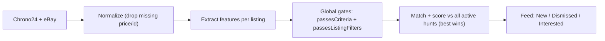

# Hunt → Feed filtering criteria

How a user's **hunts** ([Hunt Builder](hunt-builder-spec.md)) become what they see — and in what
order — in the [Vintage Timex Watches Feed](vintage-timex-watches-feed.md), and how the feed shows
*why* each listing matched. Fetch stage: [marketplace-queries.md](marketplace-queries.md). Goals:
[prd.md](prd.md).

This is the connective doc: the other three each own one stage but none owns the mapping between them.

---

## The gap

The feed currently matches listings on **model only** (`matchListingToModel()`) and sorts by recency.
The hunt builder reasons in **hunts** — multi-attribute saved searches with a **gates vs. taste** split.
Nothing yet says how a hunt's attributes and gates collapse into feed filtering, ranking, and display.

---

## Principle: gates exclude, taste ranks

| | Gates (hard) | Taste (soft) |
|---|---|---|
| Source | Global filters (all hunts) | Per-hunt attributes |
| Effect | Fails → **never appears** | Misses → **ranks lower**, still shows |
| Examples | Price ceiling, ships-to-me | "Crosshair", "Marlin", "late 60s" |
| Maps to | `passesCriteria()` (`../src/lib/shipping.ts`) | new `scoreListingAgainstHunt()` |
| Escape hatch | — | A `dealbreaker` taste value is promoted to a per-hunt gate |

The prototype treats taste as an AND filter, which empties the feed the moment a user gets specific.
Target: **rank, don't exclude.**

---

## Pipeline



Gates run **before** matching — a watch the user can't buy never burns an inbox slot.

---

## 1. Feature extraction (dependency)

Matching is only as good as what we read off a listing. Today the feed extracts **model only**. Full
matching needs the `ExtractedFeatures` schema ([§3, §8](hunt-builder-spec.md)) populated per listing.

| Feature | Source | Confidence |
|---|---|---|
| `model` | **dial/reference code**, not title | high (code) / low (title) |
| `dial`, `case`, `mvmt` | structured specs | high |
| `color` | specs / image | medium |
| `era` | parsed year → bucket | medium |
| `cond` | inferred from description | low (seller optimism) |

**Degrade gracefully:** until extraction lands, hunts match on model + gates; unextracted attributes
render **unverified**, never silent misses.

---

## 2. Matching one listing against one hunt

Effective value set per attribute = `picks ∪ customs`. **Within** an attribute: OR. **Across**
attributes: a score, not an AND.

| Attribute | Rule | Notes |
|---|---|---|
| `model` | code-resolved model ∈ values | title-only counts but low-confidence |
| `collab` | listing collab ∈ values | `Any collab` / `House brand only` mutually exclusive with named partners |
| `dial`, `color`, `case`, `mvmt` | listing value ∈ values | `Needs battery` only valid for quartz/electric |
| `era` | parsed year in bucket | buckets need confirming (see open decisions) |
| `cond` | **ladder-aware** | cosmetic rungs match "≥ requested"; `Needs battery`/`For parts` match exactly |

**Normalize** preset *and* custom values identically before comparison (so "crosshair" / "cross-hair"
collapse), or free-text recreates keyword search ([§6.3, §8](hunt-builder-spec.md)).

**Score:** `dealbreaker` miss → excluded from that hunt; otherwise sum hits weighted by importance
(nice/want/dealbreaker, [§9 #4](hunt-builder-spec.md)). Until weights ship, every specified attribute = 1.

---

## 3. Combining hunts + ranking

- A listing shows in **New** iff it passes global gates **and** matches **≥1 active hunt** (OR across hunts).
- Feed rank = its **best** hunt score; tie-break by recency.
- Record every matched hunt (for display + per-hunt scope).

```
alertSort (target): 1. best matched-hunt score desc  2. recency desc
```

---

## 4. Display — "accurately show the user's preferences"

Each **New** card gets a compact "why you're seeing this" block (inline version of the deferred
match-detail card, [§10](hunt-builder-spec.md)):

1. **Matched-hunt chip(s)** — tap to scope the feed to that hunt.
2. **Per-attribute hit / miss / unverified** — never collapse "wrong dial" into "couldn't tell."
3. **Confidence** per shown feature (high/med/low) — flags `cond` and title-only `model`.
4. **Match-strength** echo of the hunt's tightness badge, so rank order is legible.

---

## 5. Global gates mapping

GlobalFilters are the current Criteria defaults, relocated off the feed page. Reuse the existing gates:

| GlobalFilter | Existing gate | Where |
|---|---|---|
| `priceCeiling` | Max total cost | `passesCriteria()` |
| `shipsToMe` + `postalCode` | Ships-to-me | `passesCriteria()` |
| always on | Hidden / disliked excluded | `passesListingFilters()` |

- Defaults migrate from `../src/lib/criteria.ts` into the GlobalFilters store.
- **Condition leaves the gates** → it's per-hunt taste. Keep one soft default: Any-condition hunts hide
  `For parts` unless they list it.
- **Landed cost > sticker** when postal code is set ([§6.7](hunt-builder-spec.md)).
- Seller location stays out of gates; if provenance returns, it's per-hunt.

---

## 6. Scope chips

| Chip | Shows |
|---|---|
| **All hunts** | Unseen listings matching ≥1 active hunt |
| **Per-hunt** (one chip each) | Scope to a single hunt's matches |
| **Top matches** | Best hunt score clears a "strong match" threshold |

`alertScope` value space: `all \| hunt:{id} \| top`.

---

## Current vs. target (delta)

| Target | Current |
|---|---|
| Full attribute matching | `matchListingToModel()` — model only |
| Taste **ranks** survivors | Taste = AND filter (none in feed yet) |
| Rank by best hunt score, then recency | `alertSort` — recency, no taste scoring |
| Gates from GlobalFilters store | Hardcoded in `criteria.ts` |
| Condition = per-hunt taste | Condition = global gate |
| Card shows hunt + hit/miss/unverified + confidence | No match detail on card |

---

## Acceptance criteria

- **FC1:** Gates run before matching; gated-out listings never appear.
- **FC2:** A listing shows in **New** iff it passes gates **and** matches ≥1 active hunt.
- **FC3:** Rank = best hunt score, then recency; listings missing taste rank lower, don't vanish.
- **FC4:** A `dealbreaker` miss excludes from that hunt only, not the feed.
- **FC5:** Cosmetic condition matches "≥ requested"; `Needs battery`/`For parts` match exactly.
- **FC6:** Custom and preset values normalized identically.
- **FC7:** Each **New** card shows matched hunt(s), per-attribute hit/miss/**unverified**, and confidence.
- **FC8:** Without extraction, hunts degrade to model + gates; missing attributes render **unverified**.
- **FC9:** Scope resolves to `all` / `hunt:{id}` / `top`; unseen badge counts post-gate, post-match.
- **FC10:** Condition judged per-hunt; only global behavior is the soft `For parts` hide.

---

## Open decisions

1. Taste weights + "Top matches" threshold.
2. Era bucket boundaries (esp. the 60s split).
3. Gate on item price now, switch to landed total later?
4. `For parts` soft-hide for Any-condition hunts — confirm.
5. Matcher home — extend `selectors.ts` or new `../src/lib/listings/hunt-match.ts` (recommend the latter).

---

## Related files

- [hunt-builder-spec.md](hunt-builder-spec.md), [vintage-timex-watches-feed.md](vintage-timex-watches-feed.md), [marketplace-queries.md](marketplace-queries.md), [prd.md](prd.md)
- `../src/lib/listings/selectors.ts` — `unseenListings`, `alertListings`, `alertSort`, `passesListingFilters`
- `../src/lib/shipping.ts` — `passesCriteria()` · `../src/lib/criteria.ts` — defaults (→ GlobalFilters store)
- `../src/lib/listings/normalize.ts` — `matchListingToModel()` · `../src/store/caseback.ts` — `seen`, `listingStatus`, `alertScope` (+ `hunts`)
- *proposed* `../src/lib/listings/hunt-match.ts` — `scoreListingAgainstHunt()`, `matchAllHunts()`
