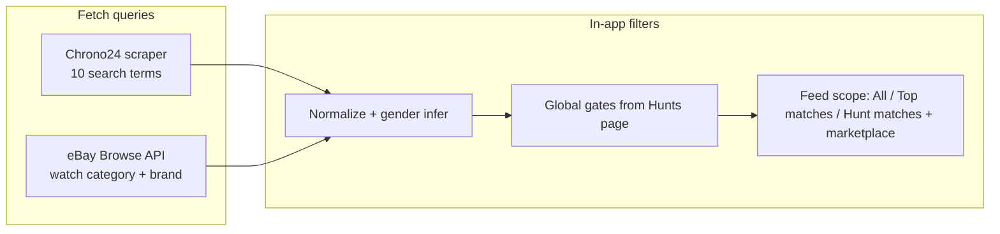

# Marketplace queries

Reference for **fetch-time queries** (what we ask Chrono24 and eBay for) and **in-app filters** (what the UI applies after listings are merged). Use the **Target (draft — edit me)** sections at the bottom of each marketplace to refine strategy without hunting through code.

---

## Overview

Listings flow through two stages:



**Fetch queries ≠ global gates.** Fetch pulls a candidate pool from each marketplace. Global filters on `/hunts` and feed scope shrink what you see. Feed UI: [vintage-timex-watches-feed.md](vintage-timex-watches-feed.md).

---

## Chrono24

### How data reaches the app

| Step | What happens |
|------|----------------|
| 1 | Python scraper runs offline: [`scripts/chrono24/chrono24_timex.py`](../scripts/chrono24/chrono24_timex.py) |
| 2 | Output written to `scripts/chrono24/vintage_timex.json` |
| 3 | `npm run sync:listings` copies to [`data/chrono24/vintage_timex.json`](../data/chrono24/vintage_timex.json) — **skips copy if scraper returned 0 listings** (preserves existing sample data) |
| 4 | Next.js reads JSON at page load — **no live Chrono24 calls** |

Loader: [`src/lib/chrono24/load-listings.ts`](../src/lib/chrono24/load-listings.ts)

### Current search queries

Used when the scraper is run with `--vintage` (`VINTAGE_QUERIES` in `chrono24_timex.py`):

| # | Query string |
|---|--------------|
| 1 | vintage Timex |
| 2 | Timex Marlin |
| 3 | Timex Viscount |
| 4 | Timex Mercury |
| 5 | Timex Sprite |
| 6 | Timex Electric |
| 7 | Timex Automatic |
| 8 | Timex mechanical |
| 9 | Timex 1970s |
| 10 | Timex 1960s |

Without `--vintage`, the scraper uses a single default query: `Timex`.

### Scraper behavior

- **Search URL:** `https://www.chrono24.com/search/index.htm?dosearch=true&query={q}&sortorder=5`
- **Pagination:** subsequent pages use `index-2.htm`, `index-3.htm`, etc.
- **HTML parsing:** each `data-article-id` block parsed independently — title, price, link, and image extracted from the same block (avoids mismatched URLs)
- **Listing URLs:** `--id{listing_id}` in path must match article id; [`canonicalizeChrono24Url()`](../src/lib/chrono24/urls.ts) applied at normalize time
- **Per-query cap:** `--max` listings per query (default 100 in CLI)
- **Deduping:** merged across queries by `listing_id`
- **Infrastructure:** FlareSolverr required for live scrape (Cloudflare); **sample JSON with real listing IDs** ships for local dev when scrape fails

**Recommended command for a fresh snapshot:**

```bash
cd scripts/chrono24
python3 chrono24_timex.py --vintage --vintage-only --max 120 --out vintage_timex.json
cd ../..
npm run sync:listings
```

### Post-fetch vintage filter (`--vintage-only`)

After all queries are merged, keep a listing only if:

- Title contains `"vintage"` (case-insensitive), **or**
- Parsed year ≤ **2000**

Year is parsed from title with regex: `\b(19[2-9]\d|20[0-2]\d)\b`

Each listing also gets an `is_vintage` flag at parse time using the same logic.

### Normalize drops (app)

In [`src/lib/listings/normalize.ts`](../src/lib/listings/normalize.ts), `normalizeChrono24Listing()`:

- Skips listings with missing `listing_id` or `price_value`
- Sets `url` via `canonicalizeChrono24Url(listing_id, raw.url)`
- Sets `gender` via `inferListingGender(title)` ([`src/lib/listings/gender.ts`](../src/lib/listings/gender.ts))

### Images (Chrono24)

Chrono24 CDN blocks browser hotlinking. Cards use [`getListingImageSrc()`](../src/lib/listings/image-url.ts) → [`/api/listing-image`](../src/app/api/listing-image/route.ts) for `*.chrono24.com` hosts. Sample snapshot may use placeholder image URLs for dev.

### Code references

| What | Where |
|------|--------|
| Query list | `VINTAGE_QUERIES` in `scripts/chrono24/chrono24_timex.py` |
| Per-article parse | `parse_article_block()`, `ARTICLE_BLOCK_RE` in same file |
| URL canonicalization | `src/lib/chrono24/urls.ts` |
| Sync guard | `scripts/sync-listings.mjs` |
| App loader | `src/lib/chrono24/load-listings.ts` |

### Target (draft — edit me)

- **Query set:** keep 10 / expand / align with eBay single query / per-model from catalog
- **Max per query:** 120 / other
- **Vintage rule:** year ≤ 2000 + title / stricter / off
- **Refresh cadence:** manual / daily / weekly
- **Open questions:**

---

## eBay

### How data reaches the app

| Step | What happens |
|------|----------------|
| 1 | **Page loads:** read disk snapshot `data/ebay/vintage_timex.json` — **no live Browse API call** (avoids 429 rate limits) |
| 2 | **Manual refresh:** `npm run sync:ebay` fetches live from Browse API, writes snapshot |
| 3 | OAuth client-credentials token cached in memory (~2h, refresh 5 min early) |
| 4 | Results normalized and merged with Chrono24 in `loadAllListings()` |
| 5 | If creds missing or no snapshot → Chrono24-only, no crash |
| 6 | Force live fetch on page load: set `EBAY_FORCE_REFRESH=1` in env |

Client: [`src/lib/ebay/client.ts`](../src/lib/ebay/client.ts)  
Snapshot: [`src/lib/ebay/snapshot.ts`](../src/lib/ebay/snapshot.ts)  
Merge: [`src/lib/listings/load-all-listings.ts`](../src/lib/listings/load-all-listings.ts)

### Current search parameters

| Parameter | Current value | Configurable? |
|-----------|---------------|---------------|
| `q` | `timex vintage watch` | Hard-coded: `EBAY_DEFAULT_QUERY` in `src/lib/ebay/schema.ts` |
| `category_ids` | `31387` (Wristwatches) | Hard-coded: `EBAY_WRISTWATCH_CATEGORY_ID` |
| `aspect_filter` | `categoryId:31387,Brand:{Timex}` | Built in client from category + brand |
| `limit` | `200` per page (max API page size) | Hard-coded: `EBAY_PAGE_SIZE` |
| `offset` | `0`, then `200`, … | Paginated until `EBAY_SEARCH_LIMIT` reached |
| Total fetched (sync) | `2000` (default) | `EBAY_SEARCH_LIMIT` env or [`schema.ts`](../src/lib/ebay/schema.ts) |
| Page load fetch | **0** (snapshot only) | Reads `data/ebay/vintage_timex.json` |
| `sort` | `newlyListed` | Hard-coded in client |
| Marketplace | `EBAY_CA` | `.env.local` → `EBAY_MARKETPLACE_ID` |
| Environment | `production` | `.env.local` → `EBAY_ENV` (`production` \| `sandbox`) |

**Why the extra filters:** A plain `q=vintage timex` matches Timex-branded apparel (sweaters, promo shirts, cycling jerseys) and other non-watch listings. Scoping to the Wristwatches category plus the Timex brand aspect keeps the candidate pool watch-shaped; a title blocklist in normalize drops stragglers (parts-only, apparel keywords).

**Env vars** (see [`.env.local.example`](../.env.local.example)):

```
EBAY_CLIENT_ID=
EBAY_CLIENT_SECRET=
EBAY_MARKETPLACE_ID=EBAY_CA
EBAY_ENV=production
# EBAY_SEARCH_LIMIT=2000          # max for npm run sync:ebay
# EBAY_FORCE_REFRESH=1            # force live API on page load (dev only)
```

**Refresh eBay data:**

```bash
npm run sync:ebay
```

### API call

```
GET /buy/browse/v1/item_summary/search
  ?q=timex+vintage+watch
  &category_ids=31387
  &aspect_filter=categoryId:31387,Brand:{Timex}
  &limit=200
  &offset=0
  &sort=newlyListed
```

Second page (when more results needed):

```
  &limit=200
  &offset=200
  &sort=newlyListed
```

Up to **2000** items total (`EBAY_SEARCH_LIMIT` default); stops early if fewer are available.

Headers:

- `Authorization: Bearer {token}`
- `X-EBAY-C-MARKETPLACE-ID: EBAY_CA` (or env override)
- `Accept: application/json`

Live API results are written to `data/ebay/vintage_timex.json`. Page loads read the snapshot; in-process memory cache TTL is 6 hours.

### Post-fetch filters (app)

In [`src/lib/listings/normalize.ts`](../src/lib/listings/normalize.ts), `normalizeEbayListing()` skips items with:

- Missing `item_id`, or
- Missing parseable `price_value`, or
- Title matches non-watch blocklist (`shouldExcludeEbayTitle()` in `src/lib/ebay/title-filter.ts`) — apparel keywords (sweater, shirt, jersey, …) and parts-only listings (strap only, movement only, …)

Listing IDs are namespaced as `ebay-{itemId}` (pipe characters in eBay IDs become hyphens) to avoid collisions with Chrono24 numeric IDs in localStorage (`seen`, `listingStatus`).

When eBay returns domestic shipping cost on the summary, it is stored as `shippingCost` and used for total-cost display when origin matches buyer region.

### Not applied at fetch time (gaps)

- No multi-query sweep (unlike Chrono24's 10 terms)
- No explicit vintage year filter (search text only; Chrono24 has `--vintage-only`)
- No price-range or condition filters on the Browse API call
- Category `31387` verified on `EBAY_CA` and `EBAY_US`; other marketplaces may need a different wristwatch category ID

### Code references

| What | Where |
|------|--------|
| Query + limit constants | `src/lib/ebay/schema.ts` — `EBAY_DEFAULT_QUERY`, `EBAY_SEARCH_LIMIT` (2000), `EBAY_PAGE_SIZE` (200), `EBAY_WRISTWATCH_CATEGORY_ID` |
| Snapshot read/write | `src/lib/ebay/snapshot.ts` |
| Title blocklist | `src/lib/ebay/title-filter.ts` — `shouldExcludeEbayTitle()` |
| OAuth + search | `src/lib/ebay/client.ts` — `fetchEbayListings()` |
| Response schema | `src/lib/ebay/schema.ts` — `ebaySearchResponseSchema` |

### Target (draft — edit me)

- **Primary query:** `timex vintage watch` + wristwatch category + Timex brand aspect *(current)*
- **Result limit:** 2000 total for `npm run sync:ebay` / page loads use disk snapshot
- **Sort:** newlyListed / price / other
- **Marketplace:** EBAY_CA *(current)* / EBAY_US
- **Title blocklist:** extend if apparel or parts-only listings still leak through
- **Future API filters:** condition, price range at source; multi-query per model
- **Open questions:** map wristwatch category ID for marketplaces beyond CA/US

---

## In-app filters (both sources)

Applied **after** Chrono24 and eBay listings are merged. Same rules for every listing regardless of source.

Defaults from global filters on `/hunts` (synced to [`src/lib/criteria.ts`](../src/lib/criteria.ts)):

| Filter | Default | Applied in |
|--------|---------|------------|
| Max total cost | ≤ $50 (on) | `passesCriteria()` in `src/lib/shipping.ts` |
| Ships to me | On — region `CA`, postal `M6K1V8` | `passesCriteria()` |
| Conditions | All except **For parts** | `passesCriteria()` |
| Hidden listings | Excluded | `passesListingFilters()` in `src/lib/listings/selectors.ts` |
| Disliked models | Excluded | `passesListingFilters()` |
| Seen / starred | Excluded from **New**; starred in own tab | `unseenListings()`, `interestedListings()` |
| Feed scope (New tab) | **All listings** / **Top matches** / **Hunt matches** + per-hunt (`hunt:{id}`) | `alertListings()` |
| Marketplace filter | All / eBay / Chrono24 | `marketplaceFilter` in selectors |
| Hunt scoring | `C × S × H` (0–8); hearts in `H` | `scoreListingAgainstHunt()` |
| Hunt gender | Per-hunt gate (8 gender options) | `listingMatchesHuntGender()` in `gender.ts` |

**Shipping estimates:** Total cost uses seeded deterministic shipping unless eBay provides a domestic `shipping_cost` on the listing. Chrono24 listings always use the estimate model today.

**Model matching:** Titles are matched to catalog models (Marlin, Viscount, etc.) via `matchListingToModel()` — not a marketplace query.

### Target (draft — edit me)

- **Default max total:** $50 / other
- **Default ship-to:** M6K1V8 / other
- **Should fetch queries respect Criteria at source?** today: **no** — yes / no
- **Open questions:**

---

## Comparison summary

| | Chrono24 | eBay |
|--|----------|------|
| Fetch mode | Static JSON (scraper) | Disk snapshot; live via `npm run sync:ebay` |
| Query count | 10 (with `--vintage`) | 1 |
| Result cap | ~120 per query, deduped across queries | 2000 total (sync); page load reads snapshot |
| Vintage filter at fetch | Yes (`--vintage-only`) | Search text only; category + brand at API |
| Non-watch exclusion | Scraper site context | Wristwatch category + title blocklist |
| Refresh | Manual scraper + `sync:listings` | `npm run sync:ebay` (or `EBAY_FORCE_REFRESH=1`) |
| Credentials | FlareSolverr URL in scraper `.env` | `EBAY_CLIENT_ID` / `EBAY_CLIENT_SECRET` in `.env.local` |
| Images | Proxied via `/api/listing-image` | Direct CDN URLs |

---

## Related files (quick index)

**Chrono24**

- `scripts/chrono24/chrono24_timex.py` — scraper, queries, vintage filter
- `scripts/chrono24/.env.example` — FlareSolverr config
- `scripts/sync-listings.mjs` — copy scraper output (with empty guard)
- `data/chrono24/vintage_timex.json` — app data snapshot
- `src/lib/chrono24/load-listings.ts` — read JSON
- `src/lib/chrono24/schema.ts` — Zod types
- `src/lib/chrono24/urls.ts` — listing URL canonicalization
- `src/lib/listings/image-url.ts` — image proxy helper
- `src/app/api/listing-image/route.ts` — Chrono24 image proxy

**eBay**

- `src/lib/ebay/schema.ts` — constants, Zod types
- `src/lib/ebay/client.ts` — OAuth + search
- `.env.local.example` — credential template

**Shared**

- `src/lib/listings/load-all-listings.ts` — merge both sources
- `src/lib/listings/normalize.ts` — map to `AppListing`
- `src/lib/criteria.ts` — Criteria defaults
- `src/lib/shipping.ts` — `passesCriteria()`, cost estimates
- `src/lib/listings/selectors.ts` — feed scope, unseen, starred, dismissed
- `src/lib/listings/hunt-match.ts` — hunt matching
- `src/lib/listings/gender.ts` — gender inference + hunt gender gate
