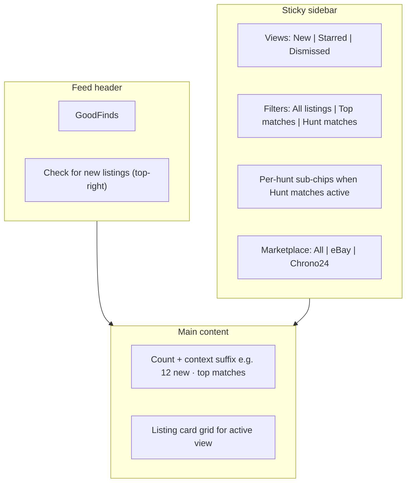

# GoodFinds — Vintage Timex Watches Feed

Product spec for the **Vintage Timex Watches Feed** (route `/`, default landing tab). Describes **shipped behavior** in GoodFinds. For marketplace fetch queries, see [marketplace-queries.md](marketplace-queries.md). For product goals, see [problem-framing.md](problem-framing.md).

Global gates (price ceiling, ships-to-me) live on the **Hunts** page (`/hunts`), not on the feed. There is no 24-hour **Older** split — all unseen listings belong in **New**.

---

## Purpose

The feed is the **inbox** for marketplace listings the user has not dismissed yet.

**Job to be done:** *"What's new that I haven't looked at, what did I mark interesting, and what did I already clear?"*

**User story:** As a vintage Timex hunter, I want a single inbox of unseen listings ranked by hunt match score, so I can scan quickly, dismiss noise, and save anything worth pursuing.

The feed is the default landing tab. Masthead nav: **Feed** | **Hunts** (optional sign-in in masthead when Supabase is configured).

---

## What the feed is / is not

| The feed is | The feed is not |
|-------------|-----------------|
| Unseen listing inbox with hunt-ranked sort | Global filters / price settings (those live on `/hunts`) |
| Dismiss + restore + interesting workflow | Model-centric "heart a model" triage (`modelHearts` retired; migrated to hunts) |
| Three top-level views: New, Starred, Dismissed | Explore tab or separate Watch List page |
| Sidebar filters for scope and marketplace | Horizontal chip bar (retired layout) |

Listings are filtered by **global gates** (price, shipping, condition) before they reach the feed. Gates sync from Global filters on the Hunts page via [`src/store/caseback.ts`](../src/store/caseback.ts).

---

## Layout

Two-column grid on `md+`: listing grid (left) + sticky sidebar (right). Mobile stacks sidebar above grid.

Component: [`feed-sidebar.tsx`](../src/components/feed-sidebar.tsx) + [`feed-view.tsx`](../src/components/feed-view.tsx).

---

## View modes (sidebar: Views)

Three views; only one active at a time. **New** is the default. Stored as `feedView` in [`src/store/caseback.ts`](../src/store/caseback.ts).

### New (default)

All **unseen** listings that match the current scope, marketplace filter, and global gates.

Sorted by [`alertSort`](../src/lib/listings/selectors.ts):

1. Best feed score (`C × S × H`, max over matched hunts — see [hunt-feed-filtering-criteria.md](hunt-feed-filtering-criteria.md))
2. Most recently listed (`listedAt` desc)

Hunt desire (`hearts` 1–4) is baked into the score via `H`; there is no separate model-hearts tie-break.

### Starred

Listings where the user toggled **Interesting** (`listingStatus.interested === true` in code). Same card grid as New; dismiss is not shown here.

### Dismissed

Listings in `seen[]` that are **not** starred. Full top-level view with muted cards and **Restore** action.

**Rules:**

- Switching views preserves dismiss and interesting state.
- A listing that is both **Starred** and **Dismissed** appears in **Starred**, not in New or Dismissed (selectors exclude interested from dismissed).

---

## New sub-scope (sidebar: Filters — only when `feedView === "new"`)

Stored as `alertScope` in [`src/store/caseback.ts`](../src/store/caseback.ts).

| Scope | Label in UI | Shows |
|-------|-------------|--------|
| `all` | All listings | All unseen listings that pass global gates |
| `top` | Top matches | Unseen listings with `feedScore ≥ 4.0` from any saved hunt |
| `watchlist` | Hunt matches | Unseen listings matching **≥1 saved hunt** (`matchedHuntIds.length > 0`) |
| `hunt:{id}` | Per-hunt name (sub-chip) | Sub-filter under Hunt matches — single saved hunt |

When **Hunt matches** is active, indented sub-chips appear: **All hunts**, each saved hunt (with hearts badge), and **New hunt** link to `/hunts`. Pencil icon beside Hunt matches opens `/hunts`.

Toggle behavior: tapping an active filter again clears back to **All listings** (except Hunt matches row, which toggles off when already on `watchlist`).

---

## Marketplace filter (sidebar: Marketplace — only when `feedView === "new"`)

Stored as `marketplaceFilter` in the store.

| Filter | Shows |
|--------|--------|
| `all` | All marketplaces |
| `ebay` | eBay listings only |
| `chrono24` | Chrono24 listings only |

Counts reflect unseen listings per source. Toggle off by tapping the active filter again.

---

## Listing cards

Each card ([`alert-listing-card.tsx`](../src/components/alert-listing-card.tsx)) shows:

- Marketplace source badge (eBay / Chrono24)
- Image carousel (Chrono24 via [`/api/listing-image`](../src/app/api/listing-image/route.ts) proxy; native `` in aspect-ratio container)
- Title, total cost, condition
- Match score on 0–8 scale (e.g. `6.0/8`) plus reasons from hunt scoring (`whyNote`, attribute hit/miss/unverified)
- Matched hunt name badge(s) when in Hunt matches scope

**Card actions (New tab)**

| Button | Effect |
|--------|--------|
| **Interesting** | Toggle saved state; listing appears in **Starred** |
| **Dismiss** | Remove from **New**; add to **Dismissed** |
| **View** | Open marketplace URL in new tab |

**Card actions (Dismissed tab)**

| Button | Effect |
|--------|--------|
| **Restore** | Remove from `seen[]`; listing returns to **New** if it still passes filters |
| **Interesting** | Still available on dismissed cards |

---

## Header actions

| Action | Behavior |
|--------|----------|
| **Check for new listings** | Top-right button; `router.refresh()` + toast |

When eBay credentials are missing, a mono hint appears below the header.

---

## Count line

`{count} {context}` — e.g. `12 new`, `3 new · top matches`, `5 new · matching Marlin hunt · Chrono24`.

Replaces the old three-part stats line (`X new · Y starred · Z dismissed`); starred/dismissed counts live in sidebar view rows.

---

## Empty states

Contextual copy in [`feed-view.tsx`](../src/components/feed-view.tsx):

- **New / All listings:** "You're all caught up"
- **New / Top matches:** "No top matches yet" — needs feed score ≥ 4.0
- **New / Hunt matches:** "No hunt matches yet" — prompts to save a hunt on `/hunts`
- **New / per-hunt:** "No matches for this hunt"
- **Starred:** "No starred listings yet"
- **Dismissed:** "Nothing dismissed"

---

## Persistence

| State | Storage |
|-------|---------|
| `seen[]` (dismissed IDs) | `caseback-state-v5` (localStorage) + [`/api/state`](../src/app/api/state/route.ts) → Supabase or `data/store/state.json` |
| `listingStatus.interested` (starred) | Same |
| `feedView`, `alertScope`, `marketplaceFilter` | Same |
| `feedView: "interested"` (legacy) | Migrated to `"starred"` on rehydrate |

Dismiss and restore show a **toast with undo**.

---

## Relationship to Hunts

| Hunts page | How it connects to the feed |
|------------|----------------------------|
| **Saved hunts** | Define what **Hunt matches** matches (gender + taste + hearts) |
| **Global filters** | Price ceiling, ships-to-me, postal code → global gates via `passesCriteria()` |
| **Purchased watches** | Collection log; does not filter the feed today |

Listing data sources: [marketplace-queries.md](marketplace-queries.md). Hunt → feed mapping: [hunt-feed-filtering-criteria.md](hunt-feed-filtering-criteria.md).

---

## Future (not shipped)

- **Explore** tab / model triage
- Masthead unseen-count badge
- Dealbreaker taste weights

Retired: model-hearts (`modelHearts`), horizontal scope chip bar, Top picks (3♥) chip.

---

## Related files

- [`src/components/feed-view.tsx`](../src/components/feed-view.tsx) — feed UI
- [`src/components/feed-sidebar.tsx`](../src/components/feed-sidebar.tsx) — sidebar filters
- [`src/components/alert-listing-card.tsx`](../src/components/alert-listing-card.tsx) — listing cards
- [`src/lib/listings/selectors.ts`](../src/lib/listings/selectors.ts) — unseen, starred, dismissed, alert sort
- [`src/lib/listings/hunt-match.ts`](../src/lib/listings/hunt-match.ts) — hunt scoring and match reasons
- [`src/lib/listings/image-url.ts`](../src/lib/listings/image-url.ts) — Chrono24 image proxy
- [`src/store/caseback.ts`](../src/store/caseback.ts) — `seen`, `listingStatus`, `feedView`, `alertScope`, `marketplaceFilter`
- [`src/components/masthead.tsx`](../src/components/masthead.tsx) — nav + auth
- [`src/components/state-sync.tsx`](../src/components/state-sync.tsx) — server persistence sync
