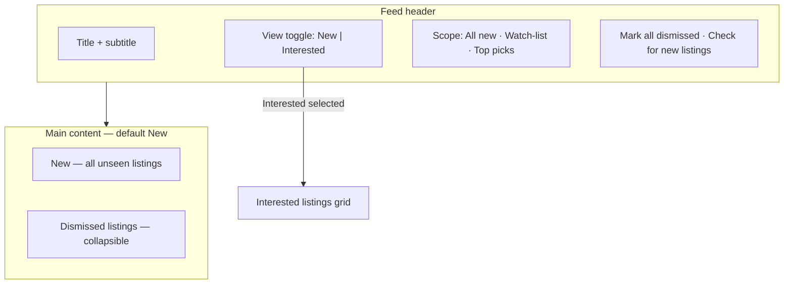

# Vintage Timex Watches Feed

Product spec for the **Vintage Timex Watches Feed** (route `/`, default landing tab). Describes **target behavior** — what Caseback is being built toward. For marketplace fetch queries, see [marketplace-queries.md](marketplace-queries.md). For overall product goals, see [prd.md](prd.md).

The masthead nav may still show **Alerts** in the app until UI copy is updated separately.

**Not covered here:** the Criteria panel (price cap, ships-to-me, condition chips) — that moves to a separate page. **Removed from the feed:** the **Older** section; all unseen listings belong in **New**.

---

## Purpose

The feed is the **inbox** for marketplace listings the user has not dismissed yet.

**Job to be done:** *“What’s new that I haven’t looked at, and what did I already clear?”*

**User story:** As a vintage Timex hunter, I want a single inbox of unseen listings ranked by my watch-list priority, so I can scan quickly, dismiss noise, and save anything worth pursuing.

The Vintage Timex Watches Feed is the default landing tab. The masthead badge shows the **unseen** count.

---

## What the feed is / is not

| The feed is | The feed is not |
|-------------|-----------------|
| Unseen listing inbox | Criteria / budget settings (separate page) |
| Dismiss + restore workflow | Watch List (model-centric) |
| Optional **Interested** view via top toggle | Explore (model triage) |

Listings are still filtered by **global gates** in the app (price, shipping, condition, etc.), but the **Criteria UI does not live on the feed page** in the target design.

---

## Layout (target)

**Excluded:** Criteria panel, **Older** section.

---

## View modes (top toggle)

Two views; only one visible at a time. **New** is the default.

### New (default)

All **unseen** listings that match the current scope and global gates — **no 24-hour split**. (The current app splits “New” vs “Older” by freshness; the target merges both into one **New** pool.)

Sorted by watch-list priority (`alertSort` in [`src/lib/listings/selectors.ts`](../src/lib/listings/selectors.ts)):

1. Higher heart count on the listing’s model first  
2. Then more recently added listings  

### Interested

Same card grid as **New**, but only listings where the user toggled **Interested** (`listingStatus.interested`). Accessed via a **top toggle** (New | Interested), not a permanent section below New.

**Rules:**

- Switching back to **New** preserves dismiss state.  
- A listing marked **Interested** and **Dismissed** appears in the **Interested** view, not in **New** (see selectors: `seenListings` excludes interested; `interestedListings` includes them).  

---

## Section: New

**Definition:** Every listing where `id` is not in `seen[]` and the listing passes listing filters (global gates, not hidden, model not disliked).

**Header**

- Title: **New**  
- Count badge  
- Subtitle: e.g. “listings you haven’t dismissed”  
- Optional bulk action: **Mark all dismissed** (dismiss all unseen in current scope)

**Card grid**

Each card shows:

- Marketplace source (eBay / Chrono24)  
- Image, title, model/year, total cost, condition  
- Watch-list heart badge when the model is on the list  

**Card actions**

| Button | Effect |
|--------|--------|
| **Interested** | Toggle saved state; listing appears in **Interested** view |
| **Dismiss** | Remove from **New**; add to **Dismissed listings** |

**Scope chips** (filter which unseen listings appear in **New**):

| Chip | Shows |
|------|--------|
| All new | All unseen listings |
| Watch-list | Unseen listings for models with ≥1 heart |
| Top picks (3♥) | Unseen listings for models with 3 hearts |

Stored as `alertScope` in [`src/store/caseback.ts`](../src/store/caseback.ts).

**Empty state**

When there are no unseen listings in the current scope: “You’re all caught up” or “Nothing new in this view” (e.g. narrow scope with no matches).

**Stats line (target copy)**

`{unseen} new · {dismissed} dismissed`

---

## Section: Dismissed listings

**Definition:** Listings the user **Dismissed** from the feed. Persisted in `seen[]` in [`src/store/caseback.ts`](../src/store/caseback.ts). (Implementation still uses “seen” in code; UI copy targets **Dismiss** / **Dismissed listings**.)

**Placement:** Collapsible section at the **bottom** of the feed page (below **New** when in default view). Expanded by default is acceptable.

**Behavior**

- Muted cards  
- **Restore** — remove from `seen[]`; listing returns to **New** if it still passes filters  
- **Interested** — still available on dismissed cards  
- Listings with `listingStatus.interested` are excluded from this section (they live in the **Interested** view instead)

**Empty:** Section hidden when count is 0.

---

## Other header actions

| Action | Target behavior |
|--------|-----------------|
| **Mark all dismissed** | Dismiss every unseen listing in the current scope (with undo toast) |
| **Check for new listings** | Trigger a fresh pull from marketplaces (future: wire to fetch; today may show a placeholder toast) |

---

## Persistence and undo

| State | Storage |
|-------|---------|
| `seen[]` (dismissed IDs) | `caseback-state-v3` via storage adapter |
| `listingStatus.interested` | Same |
| `alertScope` | Same (session may reset scope; persisted prefs TBD) |

Dismiss and restore show a **toast with undo**, reverting the last action.

---

## Relationship to other tabs

| Tab | How it connects to the feed |
|-----|----------------------------|
| **Explore** | Heart a model → adds to Watch List → boosts its listings in **New** sort order |
| **Watch List** | Heart count (1–3) drives scope chips and `alertSort` priority |
| **Criteria** (separate page) | Global gates applied before listings reach **New**; UI not on the feed page |

Listing data sources: [marketplace-queries.md](marketplace-queries.md).

---

## Current implementation vs target

Honest delta for builders ([`src/components/alerts-view.tsx`](../src/components/alerts-view.tsx) today):

| Target | Current code |
|--------|--------------|
| No Criteria on the feed page | `CriteriaPanel` still rendered |
| **New** = all unseen | Split into **New** (24h) + **Older** |
| **Dismissed listings** | Labeled **Seen** |
| **Interested** via top toggle | **Interested** is a fixed section; no view toggle |
| No **Older** | **Older** section still exists |

---

## Acceptance criteria

- **AL1:** Default view shows all unseen listings in **New** (no 24h / Older split).  
- **AL2:** **Dismiss** moves a listing to **Dismissed listings**; **Restore** reverses.  
- **AL3:** Top toggle switches between **New** and **Interested** (one view at a time).  
- **AL4:** No Criteria panel on the feed page.  
- **AL5:** No **Older** section.  
- **AL6:** Scope chips and masthead unseen badge still work.  

---

## Related files

- [`src/components/alerts-view.tsx`](../src/components/alerts-view.tsx) — feed UI (`AlertsView`)  
- [`src/components/alert-listing-card.tsx`](../src/components/alert-listing-card.tsx) — listing cards  
- [`src/lib/listings/selectors.ts`](../src/lib/listings/selectors.ts) — unseen, interested, seen, alert sort  
- [`src/store/caseback.ts`](../src/store/caseback.ts) — `seen`, `listingStatus`, `alertScope`  
- [`src/components/masthead.tsx`](../src/components/masthead.tsx) — unseen badge  
