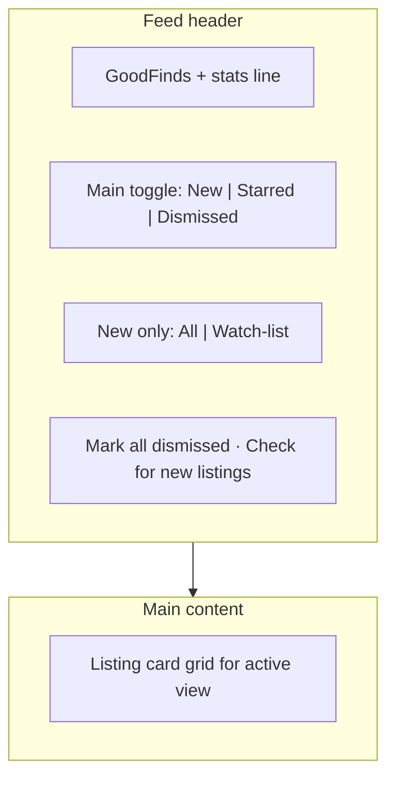

# GoodFinds — Vintage Timex Watches Feed

Product spec for the **Vintage Timex Watches Feed** (route `/`, default landing tab). Describes **shipped behavior** in GoodFinds. For marketplace fetch queries, see [marketplace-queries.md](marketplace-queries.md). For product goals, see [problem-framing.md](problem-framing.md).

Global gates (price ceiling, ships-to-me) live on the **Hunts** page (`/hunts`), not on the feed. There is no 24-hour **Older** split — all unseen listings belong in **New**.

---

## Purpose

The feed is the **inbox** for marketplace listings the user has not dismissed yet.

**Job to be done:** *“What’s new that I haven’t looked at, what did I star, and what did I already clear?”*

**User story:** As a vintage Timex hunter, I want a single inbox of unseen listings ranked by hunt match score, so I can scan quickly, dismiss noise, and star anything worth pursuing.

The feed is the default landing tab. Masthead nav: **Feed** | **Hunts** (no inbox badge).

---

## What the feed is / is not

| The feed is | The feed is not |
|-------------|-----------------|
| Unseen listing inbox with hunt-ranked sort | Global filters / price settings (those live on `/hunts`) |
| Dismiss + restore + star workflow | Model-centric “heart a model” triage (legacy `modelHearts` unused in UI) |
| Three top-level views: New, Starred, Dismissed | Explore tab or separate Watch List page |

Listings are filtered by **global gates** (price, shipping, condition) before they reach the feed. Gates sync from Global filters on the Hunts page via [`src/store/caseback.ts`](../src/store/caseback.ts).

---

## Layout

---

## View modes (main toggle)

Three views; only one visible at a time. **New** is the default. Stored as `feedView` in [`src/store/caseback.ts`](../src/store/caseback.ts).

### New (default)

All **unseen** listings that match the current scope and global gates.

Sorted by [`alertSort`](../src/lib/listings/selectors.ts):

1. Best matched-hunt score (from [`matchAllHunts`](../src/lib/listings/hunt-match.ts))
2. Model heart count tie-break (legacy field; no UI to set hearts today)
3. Most recently listed

### Starred

Listings where the user toggled **Star** (`listingStatus.interested === true` in code). Same card grid as New; dismiss is not shown here.

### Dismissed

Listings in `seen[]` that are **not** starred. Full top-level tab with muted cards and **Restore** action — not a collapsible section below New.

**Rules:**

- Switching views preserves dismiss and star state.
- A listing that is both **Starred** and **Dismissed** appears in **Starred**, not in New or Dismissed (selectors exclude interested from dismissed).

---

## New sub-scope (only when `feedView === "new"`)

Stored as `alertScope` in [`src/store/caseback.ts`](../src/store/caseback.ts).

| Scope | Shows |
|-------|--------|
| **All** | All unseen listings that pass global gates |
| **Watch-list** | Unseen listings that match **≥1 saved hunt** (`matchResults.matchedHuntIds.length > 0`), including gender-only hunts (e.g. Men's only with no attribute chips) |

Watch-list uses hunt matching from [`hunt-match.ts`](../src/lib/listings/hunt-match.ts) and [`alertListings()`](../src/lib/listings/selectors.ts) — **not** `modelHearts`.

---

## Listing cards

Each card ([`alert-listing-card.tsx`](../src/components/alert-listing-card.tsx)) shows:

- Marketplace source badge (eBay / Chrono24)
- Image (Chrono24 via image proxy when needed), title, model/year, total cost, condition
- Match reasons from hunt scoring (`whyNote`, attribute hit/miss/unverified)

**Card actions (New tab)**

| Button | Effect |
|--------|--------|
| **Star** | Toggle saved state; listing appears in **Starred** |
| **Dismiss** | Remove from **New**; add to **Dismissed** |
| **View listing** | Open marketplace URL in new tab |

**Card actions (Dismissed tab)**

| Button | Effect |
|--------|--------|
| **Restore** | Remove from `seen[]`; listing returns to **New** if it still passes filters |
| **Star** | Still available on dismissed cards |

---

## Header actions (New tab)

| Action | Behavior |
|--------|----------|
| **Mark all dismissed** | Dismiss every unseen listing in the current scope (undo toast) |
| **Check for new listings** | `router.refresh()` to re-fetch server listings + toast |

---

## Stats line

`{unseen} new · {starred} starred · {dismissed} dismissed`

Optional suffix when eBay credentials are missing: eBay offline hint.

---

## Empty states

Contextual copy in [`feed-view.tsx`](../src/components/feed-view.tsx):

- **New / All:** “You're all caught up”
- **New / Watch-list:** “No hunt matches yet” — prompts to save a hunt on `/hunts` or broaden criteria
- **Starred:** “No starred listings yet”
- **Dismissed:** “Nothing dismissed”

---

## Persistence

| State | Storage |
|-------|---------|
| `seen[]` (dismissed IDs) | `caseback-state-v3` (localStorage) + [`/api/state`](../src/app/api/state/route.ts) → `data/store/state.json` |
| `listingStatus.interested` (starred) | Same |
| `feedView`, `alertScope` | Same |
| `feedView: "interested"` (legacy) | Migrated to `"starred"` on rehydrate |

Dismiss and restore show a **toast with undo**.

---

## Relationship to Hunts

| Hunts page | How it connects to the feed |
|------------|----------------------------|
| **Saved hunts** | Define what **Watch-list** matches (gender + taste attributes) |
| **Global filters** | Price ceiling, ships-to-me, postal code → global gates via `passesCriteria()` |
| **Purchased watches** | Collection log; does not filter the feed today |

Listing data sources: [marketplace-queries.md](marketplace-queries.md). Hunt → feed mapping: [hunt-feed-filtering-criteria.md](hunt-feed-filtering-criteria.md).

---

## Future (not shipped in UI)

Code or specs exist but are **not exposed** in the feed UI today:

- **Top picks** scope (`alertScope: "top"`) — strong-match threshold
- **Per-hunt scope chips** (`alertScope: "hunt:{id}"`)
- **Model hearts** UI to populate `modelHearts` (sort tie-break only)
- **Explore** tab / model triage
- Masthead unseen-count badge

---

## Related files

- [`src/components/feed-view.tsx`](../src/components/feed-view.tsx) — feed UI
- [`src/components/alert-listing-card.tsx`](../src/components/alert-listing-card.tsx) — listing cards
- [`src/lib/listings/selectors.ts`](../src/lib/listings/selectors.ts) — unseen, starred, dismissed, alert sort
- [`src/lib/listings/hunt-match.ts`](../src/lib/listings/hunt-match.ts) — hunt scoring and match reasons
- [`src/store/caseback.ts`](../src/store/caseback.ts) — `seen`, `listingStatus`, `feedView`, `alertScope`
- [`src/components/masthead.tsx`](../src/components/masthead.tsx) — nav
- [`src/components/state-sync.tsx`](../src/components/state-sync.tsx) — server persistence sync
