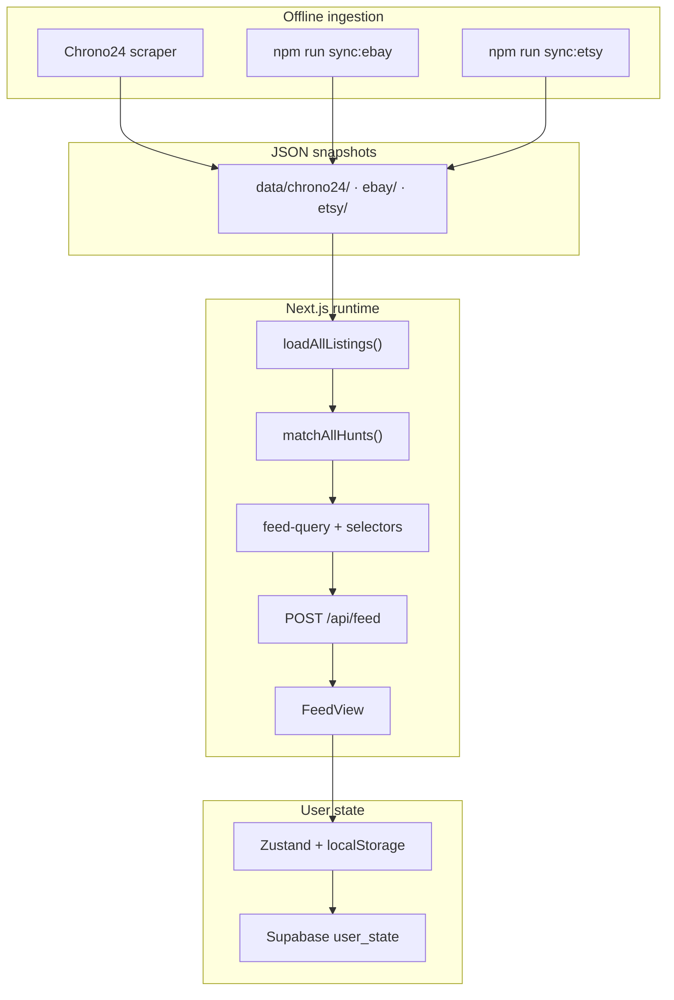

# GoodFinds

**A vintage Timex hunting assistant** — aggregate listings from eBay, Chrono24, and Etsy, triage in a feed, and define hunts for what you're looking for.

**Repo:** https://github.com/Jolien-Product-Manager/GoodFinds2.0

---

## What problem this solves

Vintage Timex collectors hunt across multiple marketplaces, know taste when they see it but can't write it as a filter, and waste attention re-judging listings they've already dismissed. GoodFinds addresses three jobs:

- **Surfacing** — stop manually checking eBay, Chrono24, and Etsy with the same queries
- **Taste capture** — store and refine what "interesting" means via hunts, not boolean query strings
- **Triage** — rank viable listings, flag the strongest candidates, and remember what you've already acted on

---

## Four things I had to get right

The central design decision: **gates exclude, taste ranks.** Hard filters (price, shipping, condition, dismissals) remove listings. Hunt matching scores and orders what remains — it does not silently hide "imperfect" matches.

| Pillar | Job-to-be-done | What shipped |
|--------|----------------|--------------|
| **1. Coverage** | Don't make me check three sites | Chrono24 scrape + eBay/Etsy APIs → JSON snapshots → normalize, vintage filter, dedupe by URL |
| **2. Understanding taste** | I know it when I see it, but can't write a filter | Hunts (gender, hearts, attribute chips, must-have vs interested) + global buy-ability gates |
| **3. Matching** | Show everything viable; flag what to look at first | Additive hunt scoring + Perfect / Close / Loose badges + match reasons on cards |
| **4. Actioning** | Don't waste my attention twice | Dismiss / Save (Interesting) / Restore with cross-session persistence via Supabase |

---

## How it's built

### 1. Coverage — snapshots, three connectors, two-layer pagination

**Marketplace choice** started from where vintage Timex hobbyists already hunt: eBay (volume, newly listed sort), Chrono24 (watch-specific inventory), Etsy (characterful one-offs). Each source has different access constraints, so each gets its own connector — not one-size-fits-all.

| Source | Approach | Why |
|--------|----------|-----|
| eBay | Browse API (OAuth, paginated REST) | Official API; category + brand aspect filters |
| Etsy | Open API v3 | Same snapshot pattern; batch image enrichment |
| Chrono24 | Offline Python HTML scrape + FlareSolverr | No public API; Cloudflare blocks naive fetch |

**Problems hit along the way:**

- **API approval** — eBay/Etsy need app registration; production page loads read **disk snapshots** so routine browsing never hits rate limits
- **RSS** — not used; marketplace RSS feeds are unreliable or gone; manual sync is more controllable
- **Scraping fragility** — Chrono24 is last resort: offline script, no live calls at runtime, sample JSON for dev when scrape fails

**Pagination has two layers:**

1. **Ingestion** — eBay offset/limit (200/page, up to `EBAY_SEARCH_LIMIT`); Etsy offset/limit (100/page); Chrono24 HTML page URLs (`index-2.htm`, …)
2. **Feed UI** — numeric cursor over a pre-filtered in-memory array; client infinite scroll via `POST /api/feed`

**Storage:** listings live as JSON files on disk (`data/chrono24/`, `data/ebay/`, `data/etsy/`). User state only in Supabase (`user_state.state` jsonb). Listings are public and high-volume; taste and actions are personal and need cross-device sync.

Fetch queries pull a **candidate pool** (e.g. eBay: `timex vintage watch`, wristwatch category, Timex brand aspect, `newlyListed`). Global gates and hunt matching run **after** merge — fetch does not know the user's postal code or hunts.

Key files: [`src/lib/listings/load-all-listings.ts`](src/lib/listings/load-all-listings.ts), [`src/lib/listings/feed-query.ts`](src/lib/listings/feed-query.ts). Details: [`.cursor/docs/marketplace-queries.md`](.cursor/docs/marketplace-queries.md).

### 2. Taste — hunts, hearts, global gates

The user is knowledge-rich and time-poor — nostalgia-driven, sub-$50 ceiling intrinsic to the hobby, not an arbitrary budget cap.

**How taste is captured:**

1. **Hunts** — primary taste object: gender, 1–4 hearts (desire/urgency), attribute chips (model, era, dial, collab, …), must-have vs interested
2. **Global filters** — buy-ability, not aesthetic: landed price ceiling, ships-to-me + postal code, allowed conditions
3. **Feed sidebar filters** — session-level hard excludes, distinct from hunt scoring
4. **Purchased watches** — paste URL → parsed feature pills as reference (not auto-fed into hunts yet)

Hearts **weight ranking**, not inclusion. Gender-only hunts still work (1/1 category pass when gender gate passes).

Key files: [`src/lib/hunts/types.ts`](src/lib/hunts/types.ts), [`src/components/hunt-builder-screen.tsx`](src/components/hunt-builder-screen.tsx). Spec: [`.cursor/docs/hunt-builder-spec.md`](.cursor/docs/hunt-builder-spec.md).

### 3. Matching — scoring equation + Perfect / Close / Loose

For each listing × each active hunt:

1. Required gender mismatch → hunt contributes **0**
2. Any **required** category miss → hunt contributes **0**
3. Count categories that pass (OR within category; unverified features **fail**)
4. `pointsContributed = categoriesPassed × HEARTS_SCORE_MULTIPLIER[hearts]`
5. **Listing score = sum across all matching hunts** (additive)

Sort: score descending, then `listedAt` descending. On the **New** tab, unseen listings float above seen.

**Match quality labels** come from the **top contributing hunt's category pass ratio** — not the raw numeric score:

| Label | Condition |
|-------|-----------|
| **Perfect Match** | 100% of hunt categories pass |
| **Close Match** | pass ratio > 50% |
| **Loose Match** | pass ratio ≤ 50% but > 0 |

Cards show a *why* note and per-attribute hit / miss / unverified chips — transparency over black-box ranking.

Key files: [`src/lib/listings/hunt-match.ts`](src/lib/listings/hunt-match.ts). Spec: [`.cursor/docs/listing-match-scoring.md`](.cursor/docs/listing-match-scoring.md).

### 4. Actioning — dismiss vs save vs seen, Supabase sync

| Action | Persists as | Effect |
|--------|-------------|--------|
| **Dismiss** | `dismissed[]` + `seen[]` | Removed from New/All; visible in Dismissed tab; undo toast |
| **Save (Interesting)** | `listingStatus.interested` | Starred view; stays in New/All unless dismissed |
| **Open / select** | `seen[]` | Loses "New" badge; does **not** remove from feed |

**Between sessions:** Zustand → localStorage → debounced `POST /api/state` → Supabase when signed in. Server wins on load when authenticated. Feed API is stateless — client sends full action state with each request.

**Not built yet:** `hiddenListings` and `dislikedModels` exist in schema and filters but have no UI to populate them.

Key files: [`src/store/caseback.ts`](src/store/caseback.ts), [`src/lib/listings/selectors.ts`](src/lib/listings/selectors.ts), [`src/components/state-sync.tsx`](src/components/state-sync.tsx).

---

## Architecture



Snapshot ingestion → normalize to `AppListing` → enrich features → apply user state + gates in-process → paginate to UI.

---

## Build plan

Phases 0–6 are **complete** (scaffold through production deploy on Vercel).

| Phase | What shipped |
|-------|--------------|
| 1 | Marketplace connectors — Chrono24 scraper, eBay Browse API, normalize & merge, vintage filter |
| 2 | Feed screen — New / Starred / Dismissed views, dismiss & restore, refresh |
| 3 | Hunt builder — 9 attribute categories + gender, hearts, Edit tiles, purchased watches |
| 4 | Feed filtering / matching — feature extraction, hunt scoring, match reasons on cards |
| 5 | Persistence — `/api/state`, localStorage, Supabase magic-link auth |
| 6 | Production deploy — Vercel, env vars, snapshot-first eBay/Etsy |

Full feature list (F1–F23): [`.cursor/docs/feature-list and build-plan.md`](.cursor/docs/feature-list%20and%20build-plan.md).

---

## How I think about building

- **Explain calculations before coding** — scoring logic was written in plain English and verified against worked examples before implementation
- **Handle unhappy paths** — empty scrapes, missing API creds, malformed listing fields; app runs Chrono24-only when eBay snapshot is absent
- **Secrets server-side only** — eBay/Etsy keys in `.env.local`; never exposed to the browser bundle
- **Small, reviewable increments** — marketplace → feed → hunts → matching → persistence → deploy, each phase shippable on its own
- **State assumptions explicitly** — e.g. fetch queries do not respect per-user postal code; gates run after merge by design

Stack: Next.js (App Router), Tailwind CSS, shadcn/ui, Zustand, Supabase.

---

## Metrics I'd watch

| Metric | Role |
|--------|------|
| **Saves per session** (North Star) | How many watches marked Interesting each visit |
| **Time to first save** | Efficiency guardrail |
| **Taste-match precision** | % of surfaced listings the user saves |
| **Coverage** | Share of relevant market actually pulled |
| **Ranking quality** | Saves concentrated near the top of the list |
| **Dismiss leakage → 0** | Same listing reappearing after dismiss |
| **Leakage → 0** | Surfaced listings over budget or undeliverable |
| **Sampled miss-rate** | Gems that existed but were never shown (counterweight against timid filtering) |

Full framing: [`.cursor/docs/problem-framing.md`](.cursor/docs/problem-framing.md).

---

## Run it locally

```bash
npm install
cp .env.local.example .env.local   # eBay + Supabase keys (optional)
npm run dev
```

Open [http://localhost:3000](http://localhost:3000) for the feed. Hunts live at `/hunts`.

**Feed sidebar:** All listings · New listings · Starred · Dismissed. Scope filters: **Hunt matches** (with per-hunt sub-chips) · **Marketplace** (eBay / Chrono24 / Etsy).

### Chrono24 data

The app reads a static JSON snapshot (no live Chrono24 calls):

```bash
cd scripts/chrono24
pip install -r requirements.txt
python3 chrono24_timex.py --vintage --vintage-only --max 120 --out vintage_timex.json
cd ../..
npm run sync:listings
```

Sample data ships in `data/chrono24/vintage_timex.json` for local dev. `sync:listings` **does not overwrite** existing data if the scraper returns 0 listings (e.g. without FlareSolverr).

Chrono24 images are proxied via `/api/listing-image` (CDN blocks browser hotlinking).

### eBay (optional)

Set in `.env.local`:

```
EBAY_CLIENT_ID=
EBAY_CLIENT_SECRET=
EBAY_MARKETPLACE_ID=EBAY_CA
EBAY_ENV=production
```

**Page loads use the disk snapshot** (`data/ebay/vintage_timex.json`) — not live API — to avoid rate limits. Refresh with:

```bash
npm run sync:ebay
```

Without credentials or snapshot the app runs Chrono24-only. Sync fetches up to **10,000** listings by default (override via `EBAY_SEARCH_LIMIT` in `.env.local`).

### Etsy (optional)

Register an app at [etsy.com/developers](https://www.etsy.com/developers) and add to `.env.local`:

```
ETSY_API_KEY=your_keystring:your_shared_secret
```

Page loads read the disk snapshot (`data/etsy/vintage_timex.json`) — not live API. Refresh with:

```bash
npm run sync:etsy
```

Default search query: `vintage timex watch`. Override with `ETSY_SEARCH_QUERIES` (pipe-separated).

### Supabase auth (optional)

Sign in with magic-link email to sync hunts, dismissals, and stars across devices.

1. Create a Supabase project and run `supabase/schema.sql`
2. Add `NEXT_PUBLIC_SUPABASE_URL` and `NEXT_PUBLIC_SUPABASE_ANON_KEY` to `.env.local`
3. Configure auth redirect: `http://localhost:3000/auth/callback`

Without Supabase, state persists to `data/store/state.json` locally.

### Deploy (Vercel)

1. Push to GitHub and import the repo in [Vercel](https://vercel.com).
2. Set environment variables: eBay keys, Supabase keys (recommended for persistence).
3. Deploy — `vercel.json` is included.

**Note:** Without Supabase, user state on Vercel's ephemeral filesystem resets between cold starts. Use Supabase for production persistence.

### Scripts

| Command | Description |
|---------|-------------|
| `npm run dev` | Development server |
| `npm run build` | Production build |
| `npm run sync:listings` | Copy Chrono24 scraper output into `data/chrono24/` |
| `npm run sync:ebay` | Fetch eBay listings and write `data/ebay/vintage_timex.json` |
| `npm run sync:etsy` | Fetch Etsy listings and write `data/etsy/vintage_timex.json` |
| `npm run enrich:chrono24` | Enrich Chrono24 snapshot with real image URLs (needs FlareSolverr) |

### Commit with change details

```bash
./commit "Your commit title" --all --push
```

---

## Docs

Product and build specs: [`.cursor/docs/`](.cursor/docs/) — start with [feature-list and build-plan.md](.cursor/docs/feature-list%20and%20build-plan.md).
