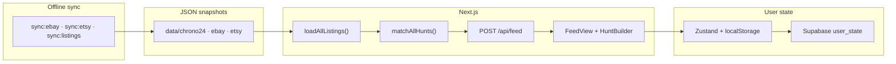

# GoodFinds

**A vintage Timex hunting assistant** — aggregate listings from eBay, Chrono24, and Etsy; triage in a ranked feed; define hunts for what you're looking for.

**Repo:** https://github.com/Jolien-Product-Manager/GoodFinds2.0

---

## What problem this solves

Vintage Timex collectors hunt across multiple marketplaces, know taste when they see it but can't write it as a filter, and waste attention re-judging listings they've already dismissed. GoodFinds addresses three jobs:

- **Surfacing** — stop manually checking eBay, Chrono24, and Etsy with the same queries
- **Taste capture** — store what "interesting" means via hunts (gender, hearts, attribute chips), not boolean query strings
- **Triage** — rank viable listings, flag the strongest candidates, and remember dismissals and saves

---

## Key design decisions

| Decision | Rationale |
|----------|-----------|
| **Gates exclude, taste ranks** | Price, shipping, condition, and dismissals remove listings. Hunt matching scores and orders what remains — imperfect matches stay visible. |
| **Snapshot ingestion** | eBay/Etsy sync offline to JSON; page loads read disk, not live APIs. Avoids rate limits and keeps the feed fast on serverless. |
| **Fetch ≠ filter** | Marketplace queries pull a broad candidate pool. Per-user gates (postal code, price ceiling) run after merge. |
| **Additive hunt scoring** | A listing's score is the sum of points from all matching hunts. Perfect matches sort first, then score, then recency. |
| **Stateless feed API** | Client sends full filter + action state with each `POST /api/feed` request. Server has no per-user feed session. |

---

## What's built

- **3 marketplace connectors** — Chrono24 (Python scrape), eBay Browse API, Etsy Open API → normalized `AppListing` pool
- **Feed** — All / New / Starred / Dismissed views; infinite scroll; listing detail panel; swipe-to-dismiss
- **Hunt builder** — 9 attribute categories + gender, hearts (1–4), must-have vs interested, purchased watches log
- **Matching** — Feature extraction from titles; additive hunt scoring (`categoriesPassed × hearts`); Perfect / Close / Loose badges with match reasons on cards
- **Filters** — Multi-select hunt filters + match-quality filters; marketplace filter; global buy-ability gates on `/hunts`
- **Persistence** — Zustand + localStorage; debounced sync to Supabase (magic-link auth) or local file fallback
- **Production** — Vercel deploy; committed JSON snapshots; bundled Etsy fallback for serverless

## What's not built

- Push/email alerts or scheduled ingestion at runtime
- Purchased watches influencing hunt matching
- Dealbreaker taste weights (`hiddenListings` / `dislikedModels` in schema, no UI)
- Live Chrono24 calls at runtime

---

## Architecture



**Stack:** Next.js 15 (App Router), React 19, Tailwind 4, shadcn/Radix, Zustand, Zod, Supabase.

---

## Run locally

```bash
npm install
cp .env.local.example .env.local   # optional: eBay, Etsy, Supabase keys
npm run dev
```

Open [http://localhost:3000](http://localhost:3000). Hunts at `/hunts`.

Sample snapshots ship in `data/` — the app runs without API keys. Refresh listings:

```bash
npm run sync:ebay      # needs EBAY_CLIENT_ID + EBAY_CLIENT_SECRET
npm run sync:etsy      # needs ETSY_API_KEY
npm run sync:listings  # copy Chrono24 scraper output
```

**Supabase (optional):** run `supabase/schema.sql`, set `NEXT_PUBLIC_SUPABASE_URL` + `NEXT_PUBLIC_SUPABASE_ANON_KEY`, configure redirect `http://localhost:3000/auth/callback`. Without it, state saves to `data/store/state.json` locally.

**Deploy:** import repo in Vercel; set env vars. Use Supabase in production — Vercel's filesystem is ephemeral.

---

## Interview FAQ

**Why snapshots instead of live API calls?**  
eBay/Etsy rate limits and serverless cold starts make live fetch unreliable for every page view. Sync scripts refresh data on demand; the app reads JSON at runtime.

**How does hunt matching work?**  
Per listing × hunt: gender gate → count attribute categories that pass → `points = categoriesPassed × heartsMultiplier`. Listing score = sum across hunts. Perfect matches sort first. Match quality (Perfect / Close / Loose) comes from the top hunt's category pass ratio.

**How is state persisted?**  
Zustand hydrates from localStorage, then merges server state when signed in. Every store change debounces to `POST /api/state` → Supabase `user_state` jsonb column.

**What would you add next?**  
Scheduled sync + alert notifications when new listings match a hunt; richer feature extraction (dial/case from images); purchased-watch → hunt suggestions.

---

## Docs

Product specs: [`.cursor/docs/`](.cursor/docs/) — start with [feature-list and build-plan.md](.cursor/docs/feature-list%20and%20build-plan.md).
