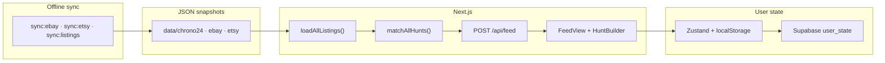

# GoodFinds

**A vintage Timex hunting assistant** that unifies listings from eBay, Chrono24, and Etsy into one ranked feed — so collectors spend less time searching and more time finding watches worth buying.

Instead of repeating the same queries across marketplaces, you define what you're looking for as **hunts**: gender, dial traits, collaborations, and priority hearts. GoodFinds scores every listing against your taste, surfaces the strongest matches first, and remembers what you've dismissed or saved.

**Repo:** https://github.com/Jolien-Product-Manager/GoodFinds2.0

---

## The problem

Vintage Timex collectors know exactly what they're hunting — a specific Marlin dial, a 1970s Electric, a Peanuts collab. The hard part is the work: manually checking eBay, Chrono24, and Etsy every day, maintaining a mental list of what to look for, and never quite being sure something good didn't slip past.

**Core job-to-be-done:** *I want a better way to stay on top of interesting vintage Timex listings across the market.*

Three failure modes today:

| | What's broken |
|---|---|
| **Surfacing** | No single source. Inventory is spread across three marketplaces. Taste must be re-encoded on every platform. Good pieces sell fast — miss a day and you miss a find. |
| **Constraints** | Total landed cost (item + shipping + duties) matters, not list price alone. Listings that can't ship to you waste attention. The sub-$50 budget is intrinsic to this hobby. |
| **Trust** | Listings mislabel model, era, and condition. The same watch can appear on multiple platforms. You end up re-reviewing listings you've already judged. |

---

## Core features

- **Unified feed** — One scrollable view of vintage Timex listings from eBay, Chrono24, and Etsy
- **Hunt builder** — Capture taste with attribute chips, gender, and 1–4 heart priority — not brittle search strings
- **Smart matching** — Score listings against your hunts; Perfect / Close / Loose badges with clear match reasons on every card
- **Fast triage** — Dismiss, star, or open in one tap; New, All, Starred, and Dismissed tabs
- **Buy-ability filters** — Price ceiling, ships-to-me, and condition gates so only realistic picks surface
- **Cross-device sync** — Optional magic-link sign-in; hunts, dismissals, and saves follow you across devices

---

## What has to work

Four things make this worth opening every day:

- **Coverage** — Earns trust. The greater our share of the vintage Timex market, the less reason to check elsewhere.
- **Taste capture** — A fast, intuitive way to encode what you're looking for — not a search box.
- **Signal-to-noise** — Surface the right listing first, with the reason visible at a glance.
- **Memory** — Never evaluate the same listing twice. Dismissals and stars persist across sessions and devices.

---

## How it works

### Hunts: gates exclude, taste ranks

**Global gates** are hard filters that apply to every hunt. A listing that fails a gate never appears — no matter how well it scores on taste.

- Price ceiling — maximum total landed cost (item + shipping)
- Ships-to-me — postal code check; excludes undeliverable listings

**Hunt attributes** rank what remains. The hunt builder pairs free-text search with structured chips across nine dimensions (model, era, gender, collab, dial traits, and more). For each attribute, you mark it as a must-have or nice-to-have — must-haves gate results, nice-to-haves boost the score.

The design principle: gates exclude, taste ranks. Mismatches rank lower; they don't disappear silently.

### Scoring and match labels

Once listings clear the gates, each listing is scored against every active hunt:

```
pointsContributed = categoriesPassed × heartsMultiplier
listingScore = Σ pointsContributed (across all matching hunts)
```

Hearts multiplier: 1♥ = 0.25 · 2♥ = 0.5 · 3♥ = 0.75 · 4♥ = 1.0

A listing that satisfies two hunts scores higher than one that satisfies one hunt equally well. Match labels come from the top contributing hunt's category pass ratio:

| Label | Criteria |
|---|---|
| **Perfect Match** | All categories in the hunt passed |
| **Close Match** | More than 50% of categories passed |
| **Loose Match** | At least one category passed, but ≤ 50% |

**Feed sort (New tab):** Perfect matches first → listing score descending → recency descending. Unseen listings float above already-seen ones.

Every card shows a "why note" — which attributes matched, which didn't, and the contributing hunt.

### Marketplace coverage

| Marketplace | Approx. listings | Share | Connection |
|---|---|---|---|
| **eBay** | ~13,500 | ~79% | Browse API — wristwatch category + Timex brand filter |
| **Etsy** | ~3,000 | ~18% | Open API v3 (bundled fallback snapshot) |
| **Chrono24** | ~500 | ~3% | Offline Python scraper via FlareSolverr |

These three cover the vast majority of addressable vintage Timex inventory. Facebook Marketplace and Reddit have meaningful activity but add complexity for smaller incremental gain — structured sources came first.

---

## What's built

- **3 marketplace connectors** — eBay Browse API, Etsy Open API, Chrono24 Python scraper → normalized `AppListing` pool
- **Feed** — All / New / Starred / Dismissed views; infinite scroll; listing detail panel; swipe-to-dismiss; bulk actions
- **Hunt builder** — 9 attribute categories + gender, hearts (1–4), must-have vs interested, purchased watches log
- **Matching** — Feature extraction from titles (model, era, gender, collab, condition); additive hunt scoring; Perfect / Close / Loose badges with match reasons
- **Filters** — Multi-select hunt filters + match-quality filters; marketplace filter; global buy-ability gates on `/hunts`
- **Persistence** — Zustand + localStorage; debounced sync to Supabase (magic-link auth) or local file fallback
- **Production** — Vercel deploy; committed JSON snapshots; bundled Etsy fallback for serverless

### What's not built yet

- Push/email alerts or scheduled ingestion at runtime
- Purchased watches influencing hunt matching
- Dealbreaker taste weights (designed, not shipped)
- Live Chrono24 calls at runtime
- Vision-based dial recognition from listing photos

---

## Architecture



**Stack:** Next.js 15 (App Router), React 19, Tailwind 4, shadcn/Radix, Zustand, Zod, Supabase.

**Data flow:**
- eBay: `npm run sync:ebay` → Browse API → `data/ebay/vintage_timex.json`
- Etsy: `npm run sync:etsy` → Open API v3 → `data/etsy/vintage_timex.json`
- Chrono24: offline Python scraper → `npm run sync:listings` → `data/chrono24/`
- All three merge in `loadAllListings()` → `normalize.ts` → `AppListing[]`

---

## Run locally

```bash
npm install
cp .env.local.example .env.local   # optional: eBay, Etsy, Supabase keys
npm run dev
```

Open [http://localhost:3000](http://localhost:3000). Hunts at `/hunts`.

Sample snapshots ship in `data/` — the app runs without API keys. Refresh listings:

```bash
npm run sync:ebay        # needs EBAY_CLIENT_ID + EBAY_CLIENT_SECRET
npm run sync:etsy        # needs ETSY_API_KEY
npm run sync:listings    # copy Chrono24 scraper output
```

**Supabase (optional):** run `supabase/schema.sql`, set `NEXT_PUBLIC_SUPABASE_URL` + `NEXT_PUBLIC_SUPABASE_ANON_KEY`, configure redirect `http://localhost:3000/auth/callback`. Without it, state saves to `data/store/state.json` locally.

**Deploy:** import repo in Vercel; set env vars. Use Supabase in production — Vercel's filesystem is ephemeral.

---

## What's next

- **Mobile app + push** — Collectors check listings on their phones. Push flips the model: the feed comes to them when a hunt matches.
- **Deeper feature extraction** — Vision-based dial recognition from photos, granular condition inference, dealbreaker weighting.
- **Learn from behavior** — Quietly tune hunt scoring from taps, dismissals, and dwell time.
- **Affiliate links** — eBay, Etsy, and Chrono24 all run affiliate programs; zero-friction monetisation on existing purchase intent.
- **Expand to other brands** — Architecture is brand-agnostic; adding Seiko or G-Shock means new queries and a model catalog, not a rebuild.

---

## Docs

Product strategy and specs: [`.cursor/docs/`](.cursor/docs/) — start with [goodfinds-product-strategy.md](.cursor/docs/goodfinds-product-strategy.md).
